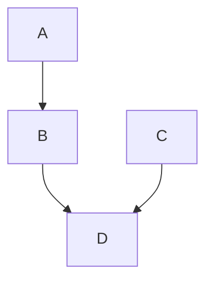
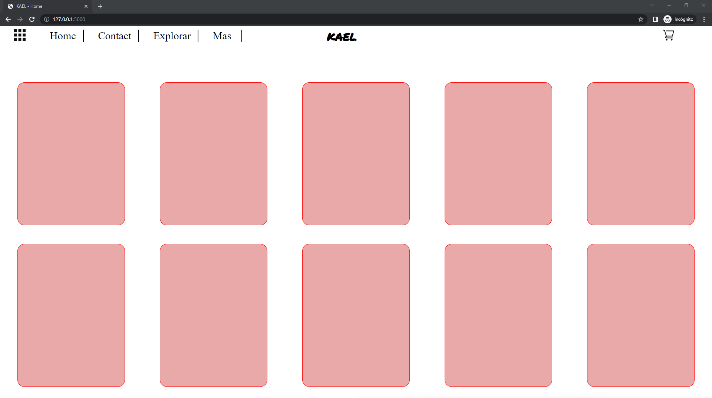

# flask ecommerce
## Inpiracion del proyecto & objetivo

- Proyecto donde trato de hacer un ecommerce con python y flask
- Tambien intento aprender como funciona ``flask y Jinja2``

El diseño web creado en <a href="https://www.figma.com/file/kP0SJhf4iDDa9kAzsz1LM1/Github-projects?node-id=0%3A1">figma</a> por Carlos cruz valencia

El proyecto se basa en los tutoriales de Tech With Tim  <a href="https://www.youtube.com/playlist?list=PLzMcBGfZo4-n4vJJybUVV3Un_NFS5EOgX">youtube flask playlist</a>
## Tecnologias usadas
- Ide
    <!-- visual studio code -->
    <code></code>

- Programas usados
    <!-- figma -->
    <code></code><!-- gitkraken -->
    <code></code>
    
    - lenguajes/frameworks usados
    <!-- bootstrap -->
    <!-- html -->
    <code></code><!-- css -->
    <code></code><!-- python -->
    <code></code><!-- sass -->
    <code></code><!-- javascript -->
    <code></img></code>
    <code></img></code>

## Vista previa del proyecto
`` vista no disponible``


<!-- </img> -->
<!-- </img> -->
## Estado del proyecto
<!-- <a href=""> En el caso de que el proyecto tenga trello</a> -->
|Trabajando en el proyecto|✔️| 
| -------------------------- | :----------------: | 

<details open>
<summary>Progreso del proyecto</summary>

#### Si el proyecto esta en desarrollo, el siguiente estado es el que se muestra en la tabla de abajo.

<details open>
<summary>Rama de directorios</summary>


</details>
<br>
<details open>
<summary>Grafico del repositorio</summary>

</details>
<br>

</img>

</details>

|            web responsive              |      ❌        |
| -------------------------- | :----------------: | 


 |           Hosting                |       Heroku      |
| -------------------------- | :----------------: | 
| websever app online          |         ❌    |  


## Licencia
Este proyecto está bajo la Licencia (MIT) - mira el archivo [LICENSE.md](LICENSE.md)  para mas detalles


<!-- ## !codigo temporal¡
## git update code
```shell
git add -A && git commit -a -m \"update\" && git push
```

## sass compiler code
```shell
sass -w --style compressed static/styles/sass/main.scss static/styles/css/main.css
``` -->
