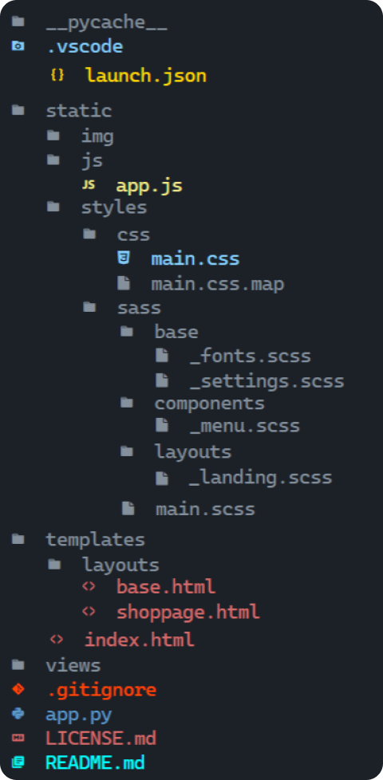
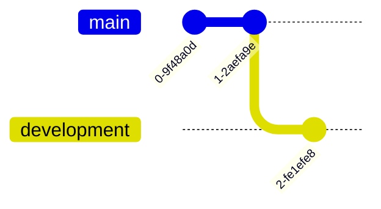
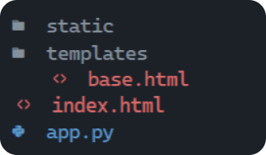
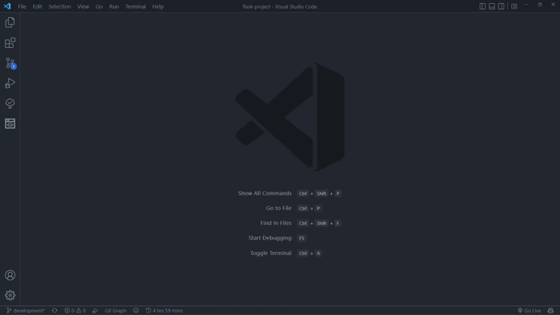
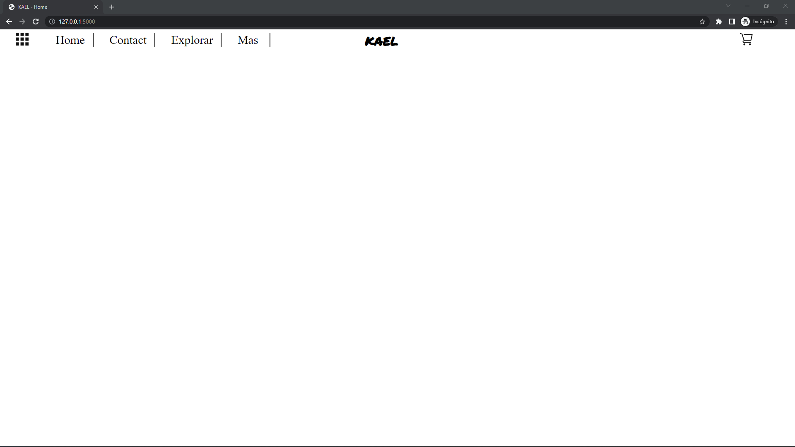
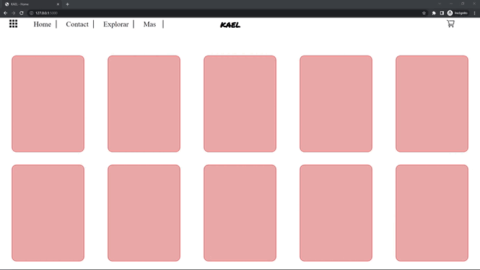

# flask ecommerce
## Inpiracion del proyecto & objetivo

- Proyecto donde trato de hacer un ecommerce con python y flask
- Tambien intento aprender como funciona ``flask y Jinja2``

El diseño web creado en <a href="https://www.figma.com/file/kP0SJhf4iDDa9kAzsz1LM1/Github-projects?node-id=0%3A1">figma</a> por Carlos cruz valencia

El proyecto se basa en los tutoriales de Tech With Tim  <a href="https://www.youtube.com/playlist?list=PLzMcBGfZo4-n4vJJybUVV3Un_NFS5EOgX">youtube flask playlist</a>
## Tecnologias usadas
- Ide
    <!-- visual studio code -->
    <code></code>

- Programas usados
    <!-- figma -->
    <code></code><!-- gitkraken -->
    <code></code>
    
    - lenguajes/frameworks usados
    <!-- bootstrap -->
    <!-- html -->
    <code></code><!-- css -->
    <code></code><!-- python -->
    <code></code><!-- sass -->
    <code></code><!-- javascript -->
    <code></img></code>
    <code></img></code>

## Vista previa del proyecto
`` vista no disponible``


<!-- </img> -->
<!-- </img> -->
## Estado del proyecto
<!-- <a href=""> En el caso de que el proyecto tenga trello</a> -->
|Trabajando en el proyecto|✔️| 
| -------------------------- | :----------------: | 
|            web responsive              |      ❌        |
|           Hosting                |       Heroku      |
| websever app online          |         ❌    |  
<details >
<summary>⚙️Progreso del proyecto⚙️</summary>
<details >
<summary>🗂️Rama de directorios🗂️</summary>

<div>
<p style = 'text-align:left;'>

</p>
</div>

</details>


<details >
<summary>🗃️Grafico del repositorio🗃️</summary>
<br>

🔧 trabajando en development para seguir el progreso del proyecto ve a la [rama de desarollo](https://github.com/Carloscruzvalencia/flask-project/tree/development)




</details>

<details >
<summary>👣 Instalacion Paso a paso👣</summary>

1. instalacion

    👉 Nesesitas instalar python para poder usar pip y poder instalar flask

    ⚠️[Python 3.10.5  descaga directa](https://www.python.org/ftp/python/3.10.5/python-3.10.5-amd64.exe)⚠️

    En la terminal ejecuta el siguiente comando:
    ```shell
    pip install flask
    ```
    🚨Tambien se instalaran los siguientes paquetes automaticamente con flask🚨
    - Werkzeug
    - Jinja2
    - wathdog
2. Creamos la carpeta del proyecto y los archivos necesarios

    </img>
    
3. Configuramos el archivo app.py
    ```python
    from flask import Flask, redirect, url_for, render_template

    app = Flask(__name__)

    @app.route('/')
    def home():
        return render_template("index.html")

    if __name__ == '__main__':
        app.run(debug=True)
    ```
4. Modificamos el archivo base.html
    ```html
        <!DOCTYPE html>
         <html lang="en">
        <head>
            <meta charset="UTF-8">
            <meta http-equiv="X-UA-Compatible" content="IE=edge">
            <meta name="viewport" content="width=device-width, initial-scale=1.0">
            <title> </title>
        </head>
        <body>
            <header>
                
                
            </header>
            <main>
                
                
            </main>
            <aside>
                
                
            </aside>
            <footer>
                
                
            </footer>
        </body>
    </html>
    ```
    
5. Modificamos el archivo index.html
    ```html
    
    ```
6. 👉Opcional👈 creamos un archivo de configuracion para el debuger

    </img>

    🚨🚨 Esto es opcional pero nos permitira ejecutar el servidor con el debuger activado🚨🚨

    tambien podemos ejecutarlo con el siguiente comando:
    ```shell
    python app.py
    ```
    ```shell
    python app.py debug
    ```
    o con el siguiente comando:
    ```shell
    flask run
    ```
🚧🚧🚧 Documentacion basica terminada 🚧🚧🚧

Pra saber mas sobre python y flask visita estos enlaces:
- [documentacion flask](https://devdocs.io/flask~2.1/)
- [documentacion jinja3](https://devdocs.io/jinja~3.0/)

    videos de youtube sobre flask:
- [Mundo python](https://www.youtube.com/watch?v=Yz1gUwXPPJw&ab_channel=MundoPython)
- [FreeCodeCamp](https://www.youtube.com/watch?v=Z1RJmh_OqeA&ab_channel=freeCodeCamp.org)
</details>


</details>

<details >
<summary>📜Desarrollo del ecomerce📜</summary>

1. Se desarolla el menu ⌚ 05/06/22
</img>

2. Se desarolla el index.html ⌚ 08/06/22

3. Se desarolla la landing page del proyecto ⌚ 11/06/22
</img>

4. Se añaden animaciones a las tarjetas de los productos ⌚ 11/06/22
</img>
</details>


## Licencia
Este proyecto está bajo la Licencia (MIT) - mira el archivo [LICENSE.md](LICENSE.md)  para mas detalles


<!-- ## !codigo temporal¡
## git update code
```shell
git add -A && git commit -a -m \"update\" && git push
```

## sass compiler code
```shell
sass -w --style compressed static/styles/sass/main.scss static/styles/css/main.css
``` -->